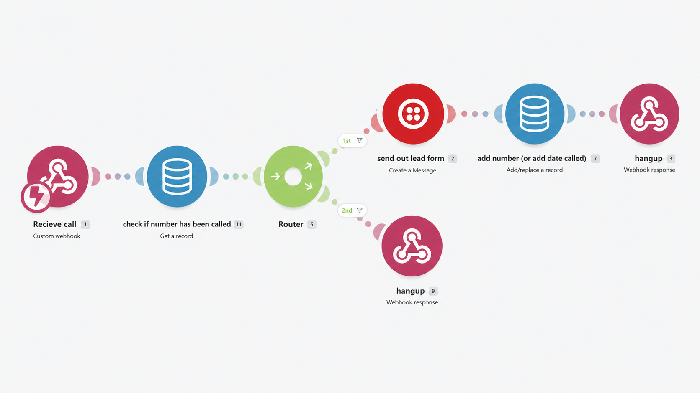
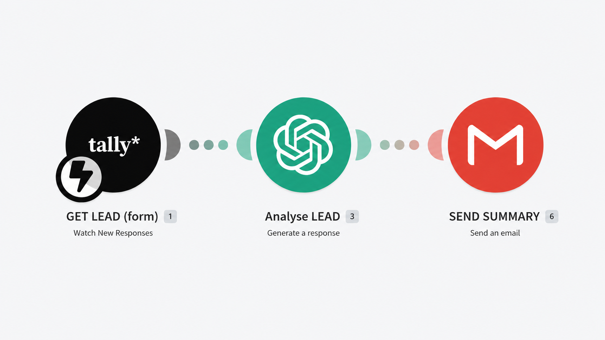
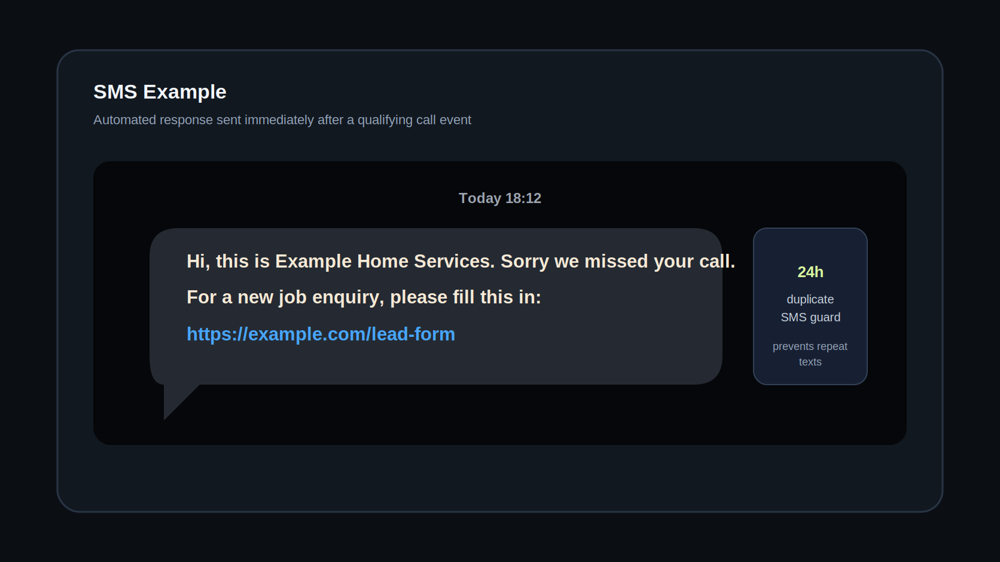
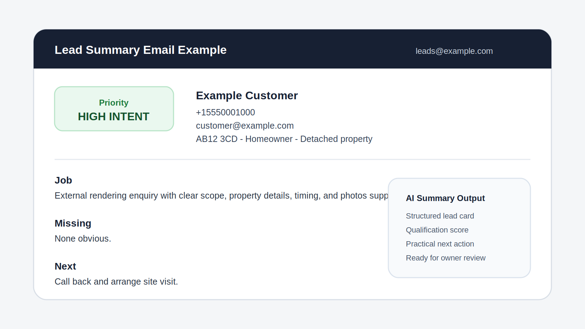

# Speed-to-Lead Make.com Automation

This repository documents a simple speed-to-lead automation system built with Make.com.

It is intended as a GitHub portfolio and documentation repo. GitHub does not run the scenarios. The JSON files in `scenarios/` are exported Make.com blueprint files that can be reviewed, or imported into Make by someone with the correct Make account and app connections.

## What It Does

The system is made from two Make.com scenarios that work together:

1. A call webhook scenario receives an incoming call event, checks whether the caller has been recorded in the last 24 hours, and sends an SMS with a Tally lead-form link only when appropriate.
2. A Tally form scenario receives a submitted lead form, uses an OpenAI module to create a short HTML lead summary, and emails that summary to the business.

## Problem

A local rendering service was missing enquiries while out on jobs and did not have a reliable way to follow up or keep track of new leads. The business also wanted to spend less time dealing with low-intent enquiries from people who were only price shopping or not ready to buy.

The automation was designed to handle three practical issues:

- Send a follow-up form automatically after a call event.
- Add useful friction so leads provide enough detail before taking up the business owner's time.
- Turn completed form submissions into structured records and clear summaries for review.

## Solution

The Make.com workflow connects phone-call capture, SMS follow-up, form capture, AI summarisation, and email notification.

The first scenario checks a Make datastore using the caller phone number. If the caller has no recent timestamp, or the timestamp is older than 24 hours, the automation sends an SMS containing a Tally form link and stores the current timestamp. If the caller is already recorded within the last 24 hours, it skips the SMS.

The form is intentionally more detailed than a basic name/email/message form. It is still easy for a serious customer to complete, but it collects enough information to qualify the enquiry before manual follow-up. Tally can also store submissions in Google Sheets, creating a lightweight lead tracker or mini CRM.

The second scenario starts when the Tally form is submitted. It maps the submitted fields into an OpenAI prompt, generates a concise HTML lead card, scores the enquiry, and sends that card by email.

## Result

The result was a more structured lead-handling process focused on higher-intent enquiries:

- Follow-up changed from a manual 12-24 hour delay to an immediate SMS after a qualifying call event.
- The 24-hour guard reduced repeated SMS follow-ups to the same caller.
- The form added enough friction to reduce low-intent enquiries before manual review.
- Completed submissions became structured lead records and clear email summaries.
- Completed form submissions represented higher-intent enquiries from people more likely to be ready for a quote or next step.
- The business no longer needed to chase every caller manually before knowing whether they were a good fit.

The next improvement would be to trigger immediate email, SMS, or call alerts for high-intent or emergency-priority leads.

## Repository Structure

```text
.
|-- architecture/
|   `-- system-overview.md
|-- docs/
|   |-- data-flow.md
|   `-- scenario-breakdown.md
|-- scenarios/
|   |-- lead-summary-email.blueprint.json
|   `-- missed-call-to-tally-form.blueprint.json
|-- screenshots/
|   `-- .gitkeep
|-- .gitignore
|-- README.md
`-- SECURITY_NOTES.md
```

## Make Blueprints

- `scenarios/missed-call-to-tally-form.blueprint.json`
- `scenarios/lead-summary-email.blueprint.json`

These are Make.com blueprint exports. They are not executable by GitHub itself.

## Security And Anonymisation

The scenario files have been anonymised for public portfolio use. Real client names, phone numbers, email addresses, live form links, WhatsApp links, Make IDs, and connection labels were replaced with placeholders.

See `SECURITY_NOTES.md` for the redaction summary.

## Screenshots

The `screenshots/` folder contains redacted portfolio screenshots of the system.

### Call To Text Scenario



### Form To AI Summary Scenario



### Output Examples

| SMS example | Lead summary email example |
| --- | --- |
|  |  |
