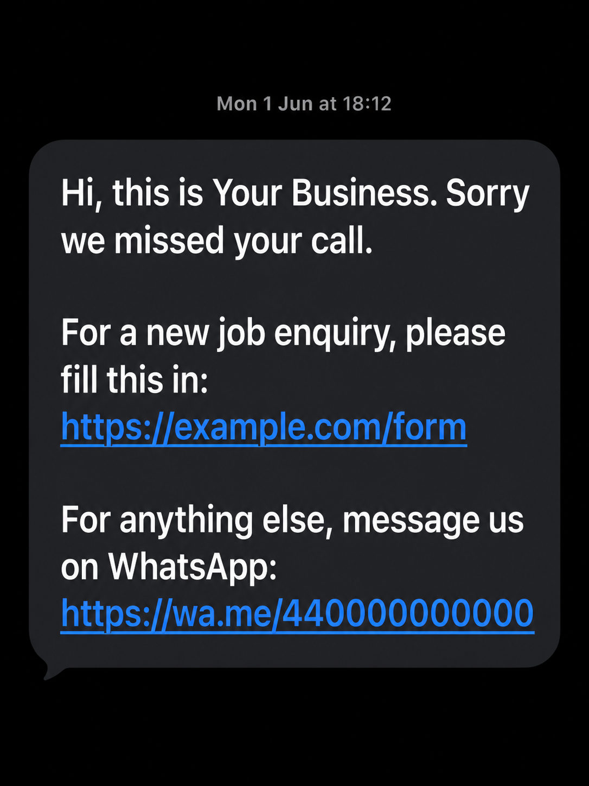
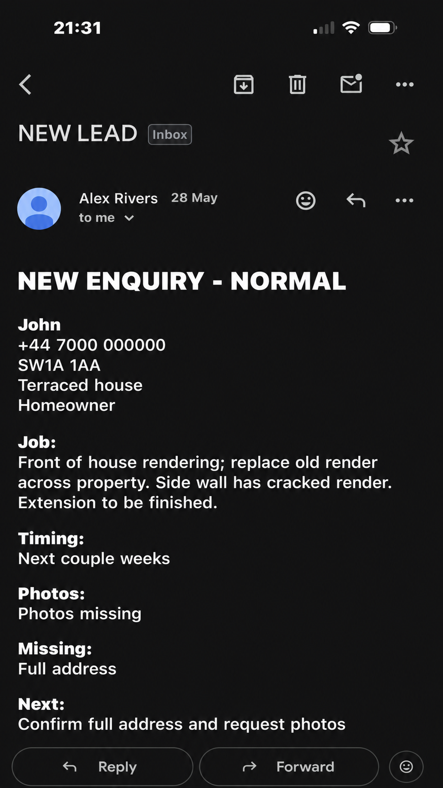

# Speed-to-Lead Make.com Automation

This repository documents a simple speed-to-lead automation system built with Make.com.

It is intended as a GitHub portfolio and documentation repo. GitHub does not run the scenarios. The JSON files in `scenarios/` are exported Make.com blueprint files that can be reviewed, or imported into Make by someone with the correct Make account and app connections.

## What It Does

The system is made from two Make.com scenarios that work together:

1. A call webhook scenario receives an incoming call event, checks whether the caller has been recorded in the last 24 hours, and sends an SMS with a Tally lead-form link only when appropriate.
2. A Tally form scenario receives a submitted lead form, uses an OpenAI module to create a short HTML lead summary, and emails that summary to the business.

## Problem

A business can miss or delay follow-up when enquiries arrive by phone. A caller may not leave enough information for the business to qualify the job, and repeated manual follow-up can be inconsistent.

The blueprint shows the automation is designed to handle three practical issues:

- Send a follow-up link after a call event.
- Avoid sending duplicate SMS messages to the same caller within 24 hours.
- Convert a completed lead form into a clear summary for review.

## Solution

The Make.com workflow connects phone-call capture, SMS follow-up, form capture, AI summarisation, and email notification.

The first scenario checks a Make datastore using the caller phone number. If the caller has no recent timestamp, or the timestamp is older than 24 hours, the automation sends an SMS containing a Tally form link and then stores the current timestamp. If the caller is already recorded within the last 24 hours, it skips the SMS.

The second scenario starts when the Tally form is submitted. It maps the submitted fields into an OpenAI prompt, generates a concise HTML lead card, and sends that card by email.

## Result

The output of the system is a faster, more structured lead-handling process:

- The caller receives a form link automatically after a qualifying call event.
- The same caller is not repeatedly texted inside the 24-hour guard window.
- The business receives a short email summary containing contact details, job details, timing, missing information, and next action.

This repo does not claim live performance metrics such as conversion rate, response time improvement, or revenue impact. Those would need to be measured separately.

## Repository Structure

```text
.
|-- architecture/
|   `-- system-overview.md
|-- docs/
|   |-- data-flow.md
|   `-- scenario-breakdown.md
|-- scenarios/
|   |-- lead-summary-email.blueprint.json
|   `-- missed-call-to-tally-form.blueprint.json
|-- screenshots/
|   `-- .gitkeep
|-- .gitignore
|-- README.md
`-- SECURITY_NOTES.md
```

## Make Blueprints

- `scenarios/missed-call-to-tally-form.blueprint.json`
- `scenarios/lead-summary-email.blueprint.json`

These are Make.com blueprint exports. They are not executable by GitHub itself.

## Security And Anonymisation

The scenario files have been anonymised for public portfolio use. Real client names, phone numbers, email addresses, live form links, WhatsApp links, Make IDs, and connection labels were replaced with placeholders.

See `SECURITY_NOTES.md` for the redaction summary.

## Screenshots

The `screenshots/` folder contains redacted portfolio screenshots of the system.

### Call To Text Scenario


### Form To AI Summary Scenario


### SMS Example



### Lead Summary Email Example


