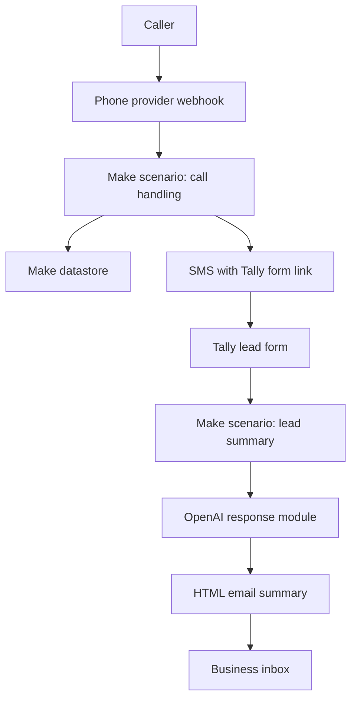

# System Overview

This project documents a two-scenario Make.com automation for handling inbound home-service enquiries quickly.

## High-Level Architecture

## Components Visible In The Blueprints

- Make.com custom webhook
- Make datastore
- Router filters
- Twilio SMS module
- Tally new response trigger
- OpenAI response module
- Gmail send email module
- Webhook XML response with `<Hangup/>`

## Operational Intent

The system is designed to reduce delay between a phone enquiry and a structured lead capture process.

The first scenario avoids repeatedly texting the same caller by using a 24-hour datastore guard. The second scenario turns the completed form into a concise lead summary for review.

## Limitations

- GitHub cannot execute these Make scenarios.
- The blueprints require Make.com and connected third-party accounts.
- The public blueprints use placeholder IDs and connection labels.
- Public screenshots should be redacted before publishing.
