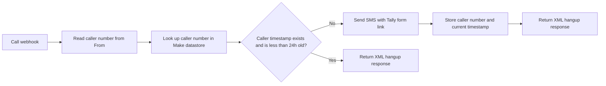
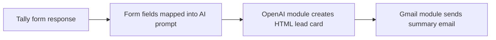

# Data Flow

This data-flow description is based only on the visible blueprint JSON.

## Call To Form Flow

### Data Used

- Caller phone number: `From`
- Datastore key: caller phone number
- Datastore timestamp field: `Missed_call_sms_guard`
- SMS destination: caller phone number
- SMS content: lead-form link and WhatsApp fallback

## Form To Summary Flow

### Form Fields Visible In The Blueprint

- Name
- Phone number
- Email
- Postcode
- Property address
- Homeowner status
- Work required
- Property type
- Current wall/surface
- Timing
- Known issues
- Photo uploads
- Extra notes

### AI Output Requested By The Prompt

- Lead priority
- Contact details
- Job summary
- Timing
- Photo status
- Missing information
- Suggested next action
